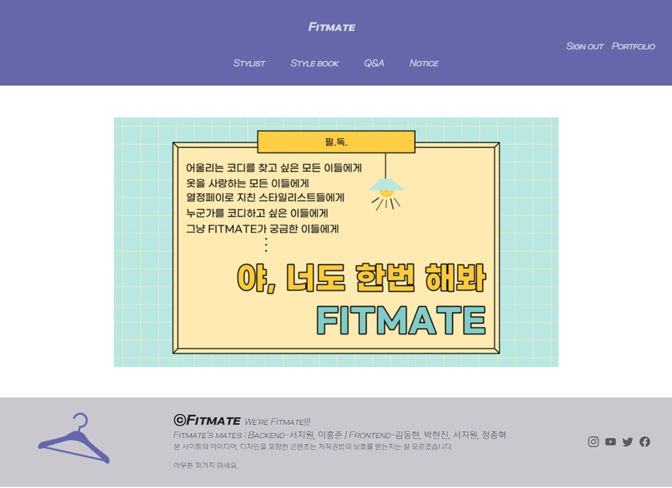
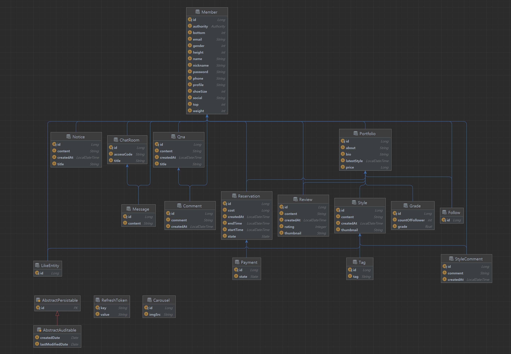

# Fitmate

## 🤔 ‘소개팅할 때 뭐 입고 가지?’

 그런 생각해 본 적 없나요? *‘내일 출근할 때 뭐 입고 가지?’, ‘여행갈 때 뭐 입지?’* 등등... 패알못이지만 가끔 차려입고 가고 싶은 날이 있잖아요. 그렇지만 어떻게 입어야 할 지 도무지 모르겠고... 그럴 때면 ‘나를 위한 스타일리스트가 있었으면...’ 하고 생각하게 되죠. 그래서 준비해봤어요.

### **“스타일리스트 매칭 서비스!”**

## 👏 Fitmate는 이런 분들을 위해 만들었어요.

- 옷을 잘 입고 싶은 평범남 평범녀
- 내일 친구 결혼식에 가는 하객
- 특별한 기념일을 앞두고 무슨 옷을 입을지 고민하는 나
- 경력을 쌓고 싶은 스타일리스트
- 스타일링을 통해 수익을 얻고 싶은 일반인

## 💡 자, 이제 사이트를 한 번 둘러보죠!



메인 페이지 (Main page)


포트폴리오 (Portfolio, View of Stylist)


스타일리스트의 예약 정보 확인 (Schedule in Portfolio, View of Stylist)


포트폴리오_스케줄 (Schedule in Portfolio, View of User)


스타일리스트 페이지 (Stylist page)


스타일리스트 게시물 (Stylist Article)


예약 확정 후 결제 기록 확인 (History in MyPage, View of User)


상담실 (Meeting-room)

## 🎞️ 글과 사진으론 부족하다! Fitmate를 영상으로 감상해보세요!

[https://youtu.be/EnmqO5Hrvng](https://youtu.be/EnmqO5Hrvng)

:

## 🛠️ 개발에 사용한 기술 스택을 알려드릴게요.

### 🖥️ Front-end


### 🛢️ Back-end


### 🛠️ Tools


## 🏗️ 아키텍처


## 🧾Entity Relationship Diagram



## 👉 실행방법

## Server

1. Server 폴더 이동

```bash
$ cd backend/src/main/resources
```

 2. application.yml 작성

```yaml
server:
  port: [포트번호]
  ssl:
    key-store-type: PKCS12
    key-store: classpath:[인증서 주소]
    key-store-password: [인증서 store 비밀번호]
    key-password: [인증서 비밀번호]

trust:
  store: classpath:[인증서 주소]
  store.password: [인증서 비밀번호]

springdoc:
  api-docs:
    path: /api-docs

# http://서버주소/swagger-ui.html
  swagger-ui:
    path: /swagger-ui.html

spring:
  datasource:
    driverClassName: com.mysql.cj.jdbc.Driver
    url: jdbc:mysql://[DB주소]:[DB포트]/fitmate?useSSL=false&characterEncoding=UTF-8&serverTimezone=Asia/Seoul
    username: [사용자명]
    password: [비밀번호]
  jpa:
    database-platform: org.hibernate.dialect.MySQL5InnoDBDialect
    generate-ddl: true
    hibernate:
      # ddl-auto: create-drop
     ddl-auto: update
    show-sql: true
    properties:
      hibernate:
        format_sql: false
  mail:
    host: smtp.gmail.com
    port: 587
    username: [이메일]
    password: [비밀번호]
    properties:
      mail:
        smtp:
          auth: true
          starttls:
            enable: true
logging:
  level:
    org:
      springframework.web.client: DEBUG
      hibernate.SQL: DEBUG
      hibernate.type: trace

jwt:
  header: Authorization
  secret: [비밀키]

social:
  kakao:
    client-id: [클라이언트 키]
    admin-key: [관리자 키]
    redirect: [주소]
    cid: TC0ONETIME
    url:
      login: https://kauth.kakao.com/oauth/authorize
      token: https://kauth.kakao.com/oauth/token
      profile: https://kapi.kakao.com/v2/user/me
      unlink: https://kapi.kakao.com/v1/user/unlink
      payment:
        ready: https://kapi.kakao.com/v1/payment/ready
  password: [비밀키]
cloud:
  aws:
    credentials:
      accessKey: [접근키]
      secretKey: [비밀키]
    s3:
      bucket: [버킷이름]
    region:
      static: [버킷지역]
    stack:
      auto: false
```

3. 프로젝트 빌드

```bash

$ ./gradlew build
```

4. 빌드 실행

```bash
$ cd build
$ java -jar [파일명].jar
```

## Client

1. 폴더로 이동

```bash
$ cd frontend/fitmate
```

1. node_modules 설치

```bash
$ npm install
```

1. 개발 서버 실행

```bash
$ npm run serve
```

## 💻 GIT Convention

### 📌 branch 이름 구조

→ **구현기능명_Jira번호**

EX) like_367

🔸like : 구현하는 기능의 이름

🔸367 : Jira에서 like에 해당하는 story 번호

### 📌 commit 메시지 구조

→ **Type: 제목 본문** (노란색은 필수 작성)

EX) feat: 로그인 기능 구현

🔸**Type**: 어떤 내용의 commit 내용인지 type에 명시하는 태그 명(옵션)

🔸**제목**: commit 내용을 요약하여 작성

→ 긴 내용으로 작성하지 않는다!

🔸**본문**: commit 내용&설명 자세히 작성(필요한 경우)

→ commit 내용 자세히 써야 하는 경우 상세히 작성

→ 본문 작성 시 Enter 치고 작성

```
EX)
feat: portfolio 기능 구현
- 스케쥴 날짜 틀 만들기
- 주말 비활성화(선택X)
- 선택 날짜값 확인
```

### 🗂️ 태그 표(색 표시한 태그들 가장 많이 사용)

| 태그 명 | 태그 설명 |
| --- | --- |
| feat | 새로운 기능 추가 |
| perf | 성능 향상 위한 코드 수정 |
| fix | 버그 수정 |
| design | 사용자 UI 디자인 변경 |
| !breaking change | API 변경 |
| !hotfix | 급하게 치명적인 버그 수정한 경우 |
| comment | 필요한 주석 추가 및 변경 |
| docs | 문서 수정 |
| test | 테스트 추가, 테스트 리팩토링 |
| chore | 빌드 테스트 업데이트, 패키지 매니저 설정 경우 |
| rename | 파일 또는 폴더 명 수정하거나 옮기는 작업만 한 경우 |
| remove |  파일 삭제 작업만 한 경우 |
| style | 코드 포맷 변경, 새미 콜론 누락, 코드 수정 없는 경우 |
| refactor | 프로덕션 코드 리팩토링 |

## ⚖️ JIRA 규칙

🔸**Epic** : back-end / front-end 로 구분

→ 기타 Epic 등록 필요 시 추가 작성 가능( ex) UCC 제작)

🔸**Story** : 구현하고자 하는 기능명

🔸**Sub Task**: 자세한 구현 내용들 등록

🔸 **1 story points** = 1시간

## 👨‍👩‍👧‍👦팀원 소개

## 🌟 Front-end

- **서지원(94) / Front-end / UCC 편집**


- **개발 내용**
    
    **Front-end**
    
    - 메인 페이지, 네비게이션바(Navigation bar) 구현
        - 네비게이션바 내부 글꼴 배치
        - 각 링크마다 후버를 걸어 누르는 손맛이 있게 함
    - Stylists, Stylebook 페이지
        - 각 페이지의 CRUD 연결
        - 태그 검색 알고리즘 구현
        - 프로필 :
            - 프로필 사진을 아바타(원형)으로 구현하여 심미적인 기능을 향상시킴
        - 평점 :
            - 평점을 사각형 다섯 칸, 색상을 입혀서 직관적으로 알아볼 수 있도록 구현함
        - 좋아요 :
            - 좋아요가 100명 이하일 때, 200명 이하일 때, 300명 이하일 때 로고 모양을 달리함
        - 사진 리스트 :
            - 프로필 옆 사진 : CSS를 통해 후버, 그림자 효과를 주는 등의 기능 구현
            - 스타일북 : 반응형으로 구현, 웹 페이지 크기에 맞게 사진의 갯수가 바뀌도록 구현
    - 모달(Modal)
        - 게시글 :
            - <pre>를 활용하여 Enter키를 반영함
        - 모달 내 댓글 입력창 구현 :
            - Vuetify를 이용함
            - keydown을 이용해 누를 때 모달창이 꺼지지 않게 구현함
        - 모달 내 댓글 리스트 구현 :
            - 댓글 작성자를 진하게, 댓글 내용을 연하게 표시함으로써 내용 구분
            - 모달의 특성상 비동기로 구현함
        - 모달은 재활용이 가능하도록 컴포넌트로 둠
        - 하트 :
            - 하트 배치를 CSS로 구현함
    - 태그(Tag)
        - 랜덤 컬러 알고리즘 구현
    - 푸터(footer) 제작
        - CSS를 사용한 전반적인 디자인
        - 반응형으로 구현
    - Fitmate 로고 이미지 디자인

- **정종혁 / Front-end**


- **개발 내용**
    - Front-end 개발
        - 회원가입
            - 일반회원, 스타일리스트 회원 구분
            - 회원가입 기입 내용 유효성 검사
            - 이메일, 닉네임 중복체크
            - 신체 사이즈 표 첨부
        - 회원정보수정
            - 계정 정보 (이메일, 이름, 닉네임, 프로필사진)
            - 계정 보안 (비밀번호)
            - 부가정보 입력 (휴대전화, 신체 사이즈)
        - Stylist Porfolio 생성 페이지
            - Portfolio 생성 여부에 따라 달라지는 페이지 구성
            - 요금, 한 줄 소개글, 긴 소개글 작성 가능
        - Stylist Porfolio 페이지
            - 좋아요, 상담실, 공유 기능
            - 한 줄 소개글 수정, 계정 탈퇴, 회원정보 수정 기능
            - Style - 자신이 올린 게시물 확인, 게시물 등록
            - Review - 일반 회원이 쓴 리뷰 확인
            - Schedule - 일반 회원이 예약한 내역 확인
            - About - 긴 소개글 수정 기능
        - Stylist 게시물 등록
            - 게시물 내용 (글)
            - 사진 첨부 기능
            - 태그 등록 기능
        - 상담실 영상, 채팅 디자인
            - Openvidu 영상 사이즈 상대적으로 조절 (상대방 영상은 크게, 자신은 작게)
            - 전체적인 채팅 디자인 (맨 아래로 내릴 수 있는 기능, 채팅 내역을 올려도 쓸 수 있는 영역은 보이도록)
        - MyPage 페이지
            - My-Pick - 좋아요 한 게시물 나열
            - Mate - 팔로우 한 스타일리스트 나열
            - History - 예약한 주문 정보 나열
            - Review - 자신이 작성한 Review 확인 및 작성
        - 전반적인 디자인 구성

- **박현진 / Front-end**


- **개발 내용**
    
    🔸**Front-end 개발**
    
    - 로그인
        - 일반 로그인(이메일, 비밀번호)
        - 간편 로그인(Kakao 간편 로그인 API)
        - Design
    - 상담 스케줄표 및 상담 가능 스케줄표
        - 사용자 관점
            - 날짜 선택(달을 선택하여 요일 선택)
            - 시간 선택(9:00~20:00)
        - 스타일리스트 관점
            - 일/주/달 별로 제시된 스케줄
            - 각 스케줄 당 예약된 회원 정보
        - Design
    - 상담 예약
        - Kakaopay API 이용한 결제 구현
        - 상황에 따라 결제 성공/오류/실패 페이지
        - Design
    - 리뷰
        - Porpolio review
            - review R 구현
            - 해당 스타일리스트 대상으로 작성된 리뷰만 보이게 구현
        - MyPage review
            - review CR 구현
            - 별점, 내용, 사진 등록
        - Design

- **김동현 / Front-end**


- **개발 내용**
    - Notice, QnA
        - Notice CRUD
        - QnA CRUD
        - QnA 댓글 구현
    - Follow, Like
        - 게시물 Like 기능
        - 스타일리스트 Follow 기능
        - 스타일리스트 FollowList 기능
    - Stylist-Porfolio
        - Profile 페이지 구현
        - about 페이지 구현
    - MyPage 구현
        - MyPick
        - Mate구현

---

## 🌟 Back-end

- **이홍준 / Back-end**


- **개발 내용**
    - **Back-end 개발**
        - 회원가입/로그인 기능
            - Spring Security, JWT기반 인증 구현
            - kakao 로그인 연동
        - 회원 관리 기능
            - 회원 가입
                - 중복 이메일 및 닉네임 확인
            - 회원 탈퇴
            - 회원 수정
                - 프로필 사진 수정
                - 회원 정보 수정
                - 회원 비밀번호 변경
            - 계정 찾기
            - 사용자별 권한 관리(MEMBER,STYLIST,ADMIN)
        - 포트폴리오 관리 기능
            - about 기능 관리
            - 스타일리스트 Profile 수정
        - StyleBook(사진첩) 기능
            - 이미지 업로드
            - 페이지 네이션 조회 기능
        - StyleBook 댓글 기능
            - 댓글 관리
            - 댓글 페이지네이션 조회 기능
        - Amazon S3로 이미지 서버 연동
        - Swagger 3.0 초기 환경 구성
        - 상담 예약 기능
            - Quartz 를 통한 스케줄 관리(예약 메일 발송)
            - SMTP 기반 임의의 인증키 이메일 전송
        - 결제 기능
            - 카카오 페이를 이용한 결제
            - 결제 내역 관리
        - 상담 기능
            - Docker를 이용한 Openvidu & Kurento Media Server 구축
            - OpenVidu를 이용한 화상 미팅(1:1)
            - WebSocket을 이용한 1:1 채팅 연동
            - 채팅 기록 저장
            - 채팅방 입장 시 토큰기반 접근 권한 관리
            - 스타일리스트 개인 채팅방 개설
        - Letsencrypt, Certbot을 이용한 SSL 인증서 적용(https)
        - Advice 컴포넌트 정의(사용자 Exception)
            - ExceptionHandler 기반 핸들러 정의
        - Nginx 웹서버 적용
        - GitFlow를 활용한 strategy관리
    - Front-end 개발
        - 채팅방 기능
            - 채팅방 컴포넌트 구현
            - Vuex를 이용한 채팅방 상태관리
            - Axiois 기반 비동기 처리로 인증키를 통한 접근 제한(호스트 제외)
        - 채팅기능
            - 채팅 컴포넌트 구현
            - 1:1 실시간 채팅 구현, 메시지 교환
            - sockjs, webstomp을 이용한 소켓 클라이언트 구현
        - 화상 미팅 기능
            - WebRTC 기능 클라이언트 연결
            - Openvidu를 이용한 화상 미팅 컴포넌트 구현
        
- **서지원(96) / Back-end**


- **개발 내용**
    - 공지사항/질문게시판 CRUD
    - Carousel 관리
        - carousel에 들어갈 이미지 CRUD
        - front-end에서 이미지 보여지도록 구현
    - 팔로우 및 좋아요 기능 구현
        - 스타일리스트 팔로우 기능
        - Style 게시글 좋아요 기능
    - Stylists 구현
        - 최신순, 팔로우 순, 평점 순 정렬 기능 구현
        - 스타일리스트 당 5개의 스타일 연결
        - 스타일리스트 검색
            - 비슷한 이름의 스타일리스트 검색
            - 검색어를 포함한 이름의 스타일리스트 검색
    - StyleBook 구현
        - 작성된 Style 게시글을 최신순으로 정렬
    - 태그검색 구현
        - Style 게시글 연결
        - 비슷한 태그를 포함한 Style 게시판 검색
        - 검색어를 포함한 태그를 가진 Style 게시판 검색
    - Jenkins
        - jenkins를 gitlab과 webhook 연결
        - jenkins pipeline 작성
    - docker
        - mySql 이미지를 docker에 적재
